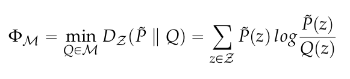
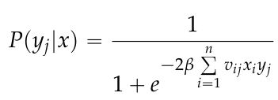

# Calculate Integrated Information Meaures for the Ising model
## Introduction
This repository contians the code used in order to generate the results discussed in...

Integrated Information Measures like the ones presented in [1],[2] or [3] are calculated by computing the KL-divergence between the initial distribution and one corresponding to a "partial" or "split" system.



This repository provides the possibility to create initial distributions systematically by fixing a weight matrix W = (w_ij) and increasing the inverse temperature β of an Ising model:



After caclulating the distributions, main.cpp allows the computation of the measures  Φ_G,  Φ_SI,  Φ_I and the new measure  Φ_CII.

## Requirements

1. python3
	* numpy
	* scipy
	* random

2. c++ compiler

## How to use

1. Create a list of the stationary distributions with Boltzmann.py
	* Number of nodes: nodes
	* Weight matrix W, default is a random matrix
	* Path where the document with the stationary distributions should be stored: path
	* Directly calculte the integrated information measure Φ_CIS: informint- works only for nodes = 2,3
	* Number of times beta is increased: num_steps 
	* Starting value of beta: beta_start
	* Value by which beta is increased: beta_diff

2. Calculate: Mutual Information, Stochastic Interaction, Geometric Integrated Information and Causal Information Integration
	1. Adjust path and number of nodes in main.cpp
	2. Conditions for Causal Information Integration and Geometric Integrated Information
	3. Execute the main.cpp program, on linux
		```console
			g++ main.cpp ProbabilityDist.cpp emIterate.cpp Test.cpp -o main
			./main
		```
	4. Output can be copy pasted to matplotlib

## References
[1] Amari, S.; Tsuchiya, N.; Oizumi, M. Geometry of Information Integration. In Information Geometry and Its
Applications; Ay, N.; Gibilisco, P.; Matúš, F. Eds.; Springer International Publishing, 2018; pp. 3–17.

[2] Kanwal, M.S.; Grochow J.A.; Ay, N. Comparing Information-Theoretic Measures of Complexity in Boltzmann
Machines. Entropy 2017, 19, 310–326

[3] Oizumi, M.; Tsuchiya, N.; and Amari, S. Unified framework for information integration based on information
geometry. PNAS 2016, 113,14817–14822.


